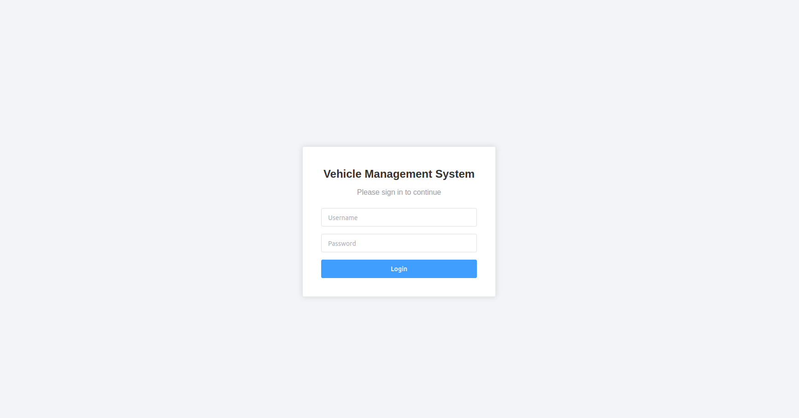
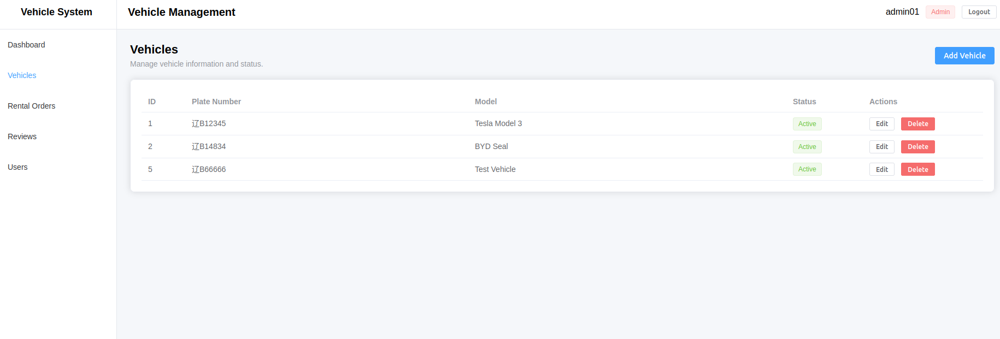
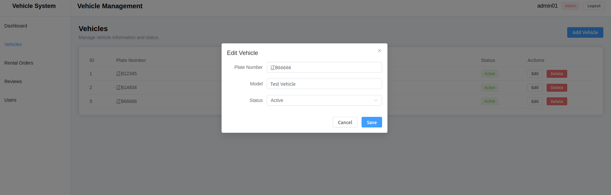

# Vehicle Status Management System

A full-stack vehicle status management system built with **ASP.NET Core Web API**, **SQL Server**, and **Vue 3**.

The project follows a layered **Controller - Service - Repository** backend architecture and a component-based Vue frontend. It includes vehicle CRUD operations, vehicle status history, JWT authentication, role-based authorization, validation, centralized exception handling, service-layer unit tests, and a browser-based management interface.

---

## Highlights

- Full-stack architecture: **Vue 3 + ASP.NET Core Web API + SQL Server**
- JWT-based login and protected API access
- Role-based authorization for **User** and **Admin**
- Vehicle CRUD with backend business-rule validation
- Vehicle status history with one-to-many database relationships
- Vue component separation with **Props / Emits**
- Centralized Axios instance with JWT request interceptor
- Vue Router with authentication navigation guard
- Element Plus management UI
- xUnit + Moq service-layer unit tests

---

## Features

### Vehicle Management

- Query all vehicles
- Query vehicle by ID
- Create vehicle information
- Update vehicle information
- Delete vehicle information
- Prevent duplicate plate numbers
- Prevent deletion of vehicles with historical status records
- Reload frontend data from the backend after successful write operations

### Vehicle Status Management

- Add vehicle status records
- Query vehicle status history
- Record temperature, speed, battery level, and timestamp
- Maintain a one-to-many relationship between vehicles and status records

### Authentication & Authorization

- User registration
- User login
- Password hashing
- JWT Bearer authentication
- Role-based authorization
- `User` and `Admin` roles
- Protected frontend routes
- Automatic JWT injection through an Axios request interceptor

Permission model:

| Operation | User | Admin |
| --- | :---: | :---: |
| View vehicles | ✓ | ✓ |
| View vehicle status | ✓ | ✓ |
| Create vehicle | ✗ | ✓ |
| Update vehicle | ✗ | ✓ |
| Delete vehicle | ✗ | ✓ |

### Validation & Exception Handling

- DTO validation with `DataAnnotations`
- Service-layer business-rule validation
- Global exception handling middleware
- Frontend error handling based on HTTP status codes

| Status Code | Scenario |
| --- | --- |
| `200` | Request succeeded |
| `201` | Resource created |
| `204` | Resource deleted |
| `400` | Invalid request parameters |
| `401` | Authentication failed / token invalid |
| `403` | Authenticated but insufficient permissions |
| `404` | Resource not found |
| `409` | Business rule conflict |
| `500` | Internal server error |

---

## Frontend

The frontend is built with **Vue 3**, **Vite**, **Axios**, **Vue Router**, and **Element Plus**.

### Login Page

The login page:

- Collects username and password
- Calls `POST /api/auth/login`
- Stores the returned JWT, username, and role in `localStorage`
- Redirects authenticated users to the vehicle management page
- Displays validation and login error messages

### Vehicle Management Page

The vehicle page provides:

- Vehicle table display
- Add vehicle dialog
- Edit vehicle dialog
- Delete confirmation dialog
- Loading state
- Empty-state display
- User / Admin role badge
- Logout
- Admin-only Create / Edit / Delete controls

### Frontend Routing

Current routes:

```text
/login
/vehicles
```

The Vue Router navigation guard redirects unauthenticated users to `/login`.

### Component Structure

```text
src/
├── components/
│   ├── LoginForm.vue
│   ├── VehicleTable.vue
│   └── VehicleDialog.vue
│
├── views/
│   ├── LoginView.vue
│   └── VehicleView.vue
│
├── router/
│   └── index.js
│
├── services/
│   └── api.js
│
├── App.vue
└── main.js
```

The frontend uses:

- **Props** to pass state from parent components to child components
- **Emits** to send user actions back to parent components
- Component `v-model` for reusable form bindings
- An Axios instance for centralized backend configuration
- Request interceptors to attach JWT Bearer tokens automatically
- Response interception for common authentication cleanup

### Frontend Preview

Current UI includes:

1. **Login Page** - centered Element Plus login card
2. **Vehicle Management Page** - sidebar, header, current user/role, vehicle table, and admin actions
3. **Add / Edit Vehicle Dialog** - reusable form dialog for POST and PUT
4. **Delete Confirmation** - Element Plus confirmation flow before DELETE

## Frontend Preview

### Login Page



### Vehicle Management



### Add / Edit Vehicle Dialog



---

## Tech Stack

### Backend

- **C#**
- **ASP.NET Core Web API**
- **SQL Server**
- **ADO.NET / Microsoft.Data.SqlClient**
- **JWT Bearer Authentication**
- **ASP.NET Core Identity PasswordHasher**
- **Async / Await**
- **Dependency Injection**
- **RESTful API**
- **OpenAPI**

### Frontend

- **Vue 3**
- **Vite**
- **Axios**
- **Vue Router**
- **Element Plus**
- **localStorage**
- **JWT Bearer Token**

### Testing & Development

- **xUnit**
- **Moq**
- **Git / GitHub**
- **Ubuntu / Linux**
- **VS Code**

---

## Architecture

### Overall Architecture

```text
Browser
   |
   v
Vue 3 Frontend
   |
   | Axios / JWT Bearer Token
   v
ASP.NET Core Web API
   |
   v
Authentication / Authorization
   |
   v
Controller
   |
   v
Service
   |
   v
Repository
   |
   v
SQL Server
```

### Backend Request Pipeline

```text
HTTP Request
     |
     v
Global Exception Middleware
     |
     v
Authentication
     |
     v
Authorization
     |
     v
Controller
     |
     v
Service
     |
     v
Repository
     |
     v
SQL Server
```

Responsibilities:

- **Controller**
  - Receives HTTP requests
  - Performs model binding
  - Returns HTTP responses

- **Service**
  - Handles business logic
  - Enforces business rules
  - Converts between DTOs and Models

- **Repository**
  - Handles database access
  - Executes SQL through ADO.NET

- **Middleware**
  - Handles global exceptions
  - Produces unified error responses

- **Vue Frontend**
  - Displays data and forms
  - Sends REST API requests
  - Manages frontend route state
  - Adds JWT tokens through Axios interceptors

---

## Project Structure

```text
vehicle-status-management-system/
│
├── src/
│   └── VehicleStatusSystem/
│       ├── Controllers/
│       ├── DTOs/
│       ├── Exceptions/
│       ├── Interfaces/
│       ├── Models/
│       ├── Repositories/
│       ├── Services/
│       ├── Program.cs
│       ├── appsettings.json
│       └── VehicleStatusSystem.csproj
│
├── tests/
│   └── VehicleStatusSystem.Tests/
│       └── Services/
│           └── VehicleServiceTests.cs
│
├── frontend/
│   └── vehicle-status-frontend/
│       ├── src/
│       │   ├── components/
│       │   ├── views/
│       │   ├── router/
│       │   ├── services/
│       │   ├── App.vue
│       │   └── main.js
│       ├── package.json
│       └── vite.config.js
│
├── database/
├── .gitignore
├── README.md
└── VehicleStatusSystem.slnx
```

---

## Database Design

The system currently contains three main tables:

```text
Users

Vehicles
    |
    | 1
    |
    | N
VehicleStatusRecords
```

### Vehicles

Main fields:

```text
Id
PlateNumber
Model
Status
CreateTime
```

`PlateNumber` has a unique constraint.

### VehicleStatusRecords

Main fields:

```text
Id
VehicleId
Temperature
Speed
Battery
RecordTime
```

`VehicleId` is a foreign key referencing `Vehicles.Id`.

### Users

Main fields:

```text
Id
Username
PasswordHash
Role
CreatedAt
```

Passwords are stored as hashes rather than plain text.

---

## Main API Endpoints

### Authentication

```http
POST /api/auth/register
POST /api/auth/login
```

### Vehicles

```http
GET    /api/vehicles
GET    /api/vehicles/{id}
POST   /api/vehicles
PUT    /api/vehicles/{id}
DELETE /api/vehicles/{id}
```

### Vehicle Status

```http
GET  /api/vehicles/{vehicleId}/status
POST /api/vehicles/{vehicleId}/status
```

Protected endpoints use:

```http
Authorization: Bearer <token>
```

---

## Authentication Flow

```text
Login Page
    |
    v
POST /api/auth/login
    |
    v
AuthController
    |
    v
AuthService
    |
    +---- UserRepository
    |
    +---- PasswordHasher
    |
    v
JwtTokenService
    |
    v
JWT Token
    |
    v
localStorage
    |
    v
Axios Request Interceptor
    |
    v
Authorization: Bearer <token>
```

The backend validates:

- Token signature
- Issuer
- Audience
- Expiration
- User claims
- Role claims

---

## Testing

The project includes service-layer unit tests using **xUnit** and **Moq**.

Current tests focus on core `VehicleService` business behavior such as:

- Vehicle existence checks
- Delete behavior
- Preventing deletion when historical records exist
- Duplicate plate-number validation
- Update failure / conflict scenarios

Run the tests:

```bash
dotnet test
```

---

## Logging

The backend uses ASP.NET Core `ILogger`.

Examples:

```text
Information
- Vehicle created
- Vehicle updated
- Vehicle deleted

Warning
- Resource not found
- Business rule violation
- Authentication failure

Error
- Unhandled application exception
- Database or system failure
```

Global exception handling prevents internal exception details from being exposed directly to clients.

---

## Configuration

Sensitive values should not be committed to Git.

Development secrets such as:

```text
ConnectionStrings:DefaultConnection
Jwt:SecretKey
```

can be stored with **.NET User Secrets**.

Example:

```bash
dotnet user-secrets set \
"ConnectionStrings:DefaultConnection" \
"<YOUR_CONNECTION_STRING>"
```

```bash
dotnet user-secrets set \
"Jwt:SecretKey" \
"<YOUR_JWT_SECRET>"
```

Do not commit database passwords, JWT secret keys, or valid JWT tokens.

---

## How to Run

### 1. Clone

```bash
git clone https://github.com/Conner555/vehicle-status-management-system.git
cd vehicle-status-management-system
```

### 2. Configure and run the backend

```bash
cd src/VehicleStatusSystem
dotnet restore
dotnet build
dotnet run
```

Configure SQL Server and the JWT secret before starting the backend.

The development API currently uses a local address such as:

```text
http://localhost:5129
```

### 3. Run backend tests

From the repository root:

```bash
dotnet test
```

### 4. Install and run the frontend

Open another terminal:

```bash
cd frontend/vehicle-status-frontend
npm install
npm run dev
```

The Vite development server normally runs at:

```text
http://localhost:5173
```

### 5. Frontend-to-backend communication

The Axios instance is configured in:

```text
frontend/vehicle-status-frontend/src/services/api.js
```

For local development, make sure the backend CORS policy allows the frontend origin.

---

## Current Status

Implemented:

- [x] Vehicle CRUD
- [x] Vehicle status history
- [x] SQL Server persistence
- [x] Repository / Service architecture
- [x] Dependency Injection
- [x] Async database operations
- [x] DTO validation
- [x] Global exception handling
- [x] Structured logging
- [x] User Secrets
- [x] Password hashing
- [x] JWT authentication
- [x] User / Admin role authorization
- [x] xUnit + Moq service-layer unit tests
- [x] Vue 3 frontend
- [x] Element Plus management UI
- [x] Frontend GET / POST / PUT / DELETE integration
- [x] Vue component separation with Props / Emits
- [x] Axios instance + JWT interceptor
- [x] Vue Router
- [x] Authentication navigation guard

Planned improvements:

- [ ] Integration tests
- [ ] Docker
- [ ] CI/CD with GitHub Actions
- [ ] Pagination / search / filtering
- [ ] Expanded business modules such as rental orders and reviews

---

## Learning Goals

This project was developed to practice and understand:

- ASP.NET Core Web API architecture
- RESTful API design
- SQL Server integration
- ADO.NET asynchronous programming
- Controller / Service / Repository separation
- Dependency Injection
- DTO validation
- Authentication and authorization
- Global exception handling and logging
- Unit testing with xUnit and Moq
- Vue 3 component-based frontend development
- Props / Emits and component `v-model`
- Axios instances and interceptors
- Vue Router and navigation guards
- Frontend-backend integration
- Git / GitHub project management
